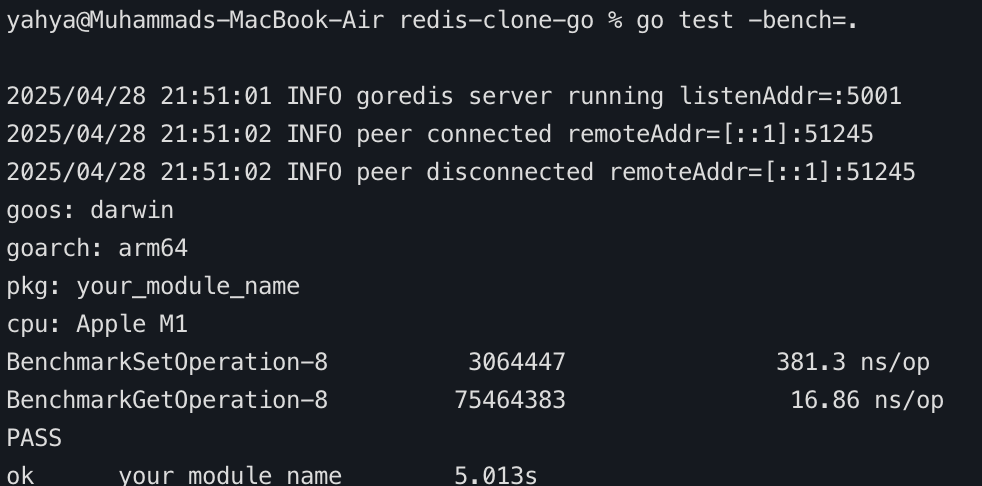

# Redis Clone in Go


---

## ✨ Overview

Lightweight, blazing-fast Redis clone written in Go.
It features a simple in-memory key-value store, a clean CLI mode, and a TCP server mode — built for speed and fun.

---

## 🖥️ CLI Demo

Here’s what the YahyaRedis CLI looks like:


- `SET <key> <value>` — store a value
- `GET <key>` — retrieve a value
- `EXIT` — quit the CLI

---

## ⚡ Benchmark Results

Tested on an **Apple M1** CPU:  



| Operation | Time (ns/op)  |
|:----------|:------------|
| `SET`     | 381.3 ns/op   |
| `GET`     | 16.86 ns/op   |

🚀 YahyaRedis achieves **GET operations in under 20 nanoseconds**!

---

## 🛠 Features

- 🔥 Fast in-memory key-value store (map + `sync.RWMutex`)
- 🖥️ Simple interactive CLI (`--cli` mode)
- 🌐 TCP server mode (`default :5001`)
- 🛡️ Thread-safe concurrent access
- 📈 Benchmark tests included

---

## 📦 Installation

Clone the repo:

```bash
git clone [https://github.com/YOUR_USERNAME/redis-clone-go.git](https://github.com/YOUR_USERNAME/redis-clone-go.git)
cd redis-clone-go
```

## Run the CLI:


```bash
go run *.go --cli
Start the server:
```

```bash
go run *.go
Run benchmarks:
```
```bash
go test -bench=.
```

## 🎯 Commands

Command	Description
SET <key> <value>	Store a value
GET <key>	Retrieve a value
EXIT	Exit CLI

## 🚀 Roadmap
[x] Core SET/GET operations
[x] Thread-safe in-memory storage
[x] CLI mode
[ ] Add DEL and KEYS commands
[ ] Support persistence to disk (RDB style)
[ ] Implement expiration (TTL)
[ ] Add clustering support (advanced)


## 📝 License
This project is licensed under the MIT License.

## 🤝 Contributing
Pull requests are welcome! For major changes, please open an issue first to discuss what you would like to 1  change.
