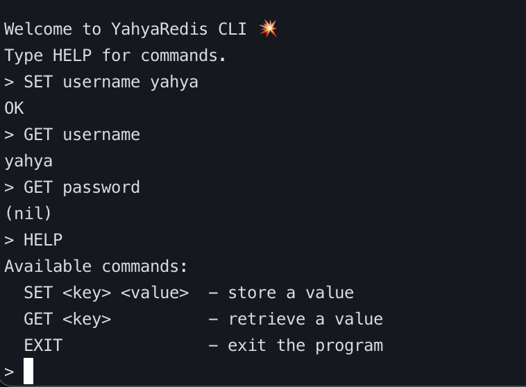

# Redis Clone in Go


## What This Is

Lightweight Redis clone in Go. In-memory key-value store with CLI and TCP server modes. Built to understand Redis internals and Go concurrency patterns.

## CLI Mode



Basic commands:
- `SET <key> <value>` - store a value
- `GET <key>` - retrieve a value
- `EXIT` - quit

## Performance

Tested on Apple M1:


| Operation | Time (ns/op) |
|-----------|--------------|
| SET       | 381.3        |
| GET       | 16.86        |

GET operations consistently under 20 nanoseconds.

## Features

- Fast in-memory storage (Go map with `sync.RWMutex`)
- Interactive CLI mode
- TCP server (default port 5001)
- Thread-safe concurrent access
- Benchmark suite included

## Installation
```bash
git clone https://github.com/YOUR_USERNAME/redis-clone-go.git
cd redis-clone-go
```

Run CLI:
```bash
go run *.go --cli
```

Start server:
```bash
go run *.go
```

Run benchmarks:
```bash
go test -bench=.
```

## Commands

| Command           | Description      |
|-------------------|------------------|
| SET <key> <value> | Store a value    |
| GET <key>         | Retrieve a value |
| EXIT              | Exit CLI         |

## Roadmap

- [x] Core SET/GET operations
- [x] Thread-safe storage
- [x] CLI mode
- [ ] DEL and KEYS commands
- [ ] Disk persistence (RDB-style)
- [ ] TTL expiration
- [ ] Clustering support

## Technical Details

### Storage
Uses Go's built-in map with read-write mutex for thread safety. Simple but effective for single-node deployments.

### Concurrency
All operations protected by `sync.RWMutex`. Multiple concurrent readers, single writer. No lock contention on read-heavy workloads.

### Server
Basic TCP server on port 5001. Handles multiple client connections. Protocol is simple newline-delimited commands.

## Known Limitations

- No persistence - data lost on restart
- No replication
- Single-node only
- Limited command set
- No authentication

This is a learning project, not production-ready.

## License

MIT License - see LICENSE file for details

## Contributing

Open an issue before starting work on major changes. Pull requests for bug fixes and small improvements welcome.
